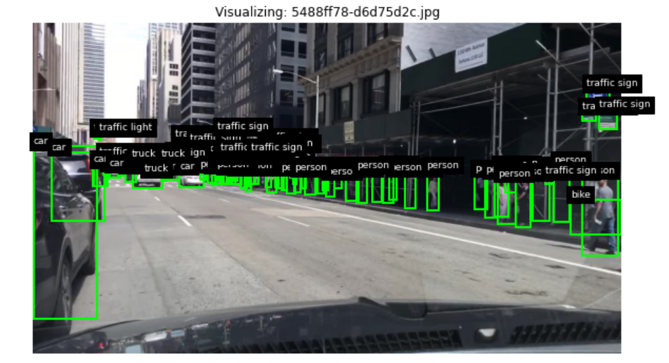

# BBD detection exercise



Following are the documents pertaining my evaulation of the exercise with BDD dataset
- [Data Distribution Analysis](https://docs.google.com/document/d/1qwkoJXZgA_X2BQpUCLy-_xKx4B7GvsrPMYORCRPYF9o/edit?usp=sharing)
- [Model Traning](https://docs.google.com/document/d/1OjFUJvytKCL1QFvPfoaz_vZuH9bhM7BaB471-Zl33dE/edit?usp=sharing)
- [Evaluation Report: Model Performance on the Validation Dataset](https://docs.google.com/document/d/1sj19CskJjfmvtgVmEjgUSOxiOAbU4m8BHBxBhslg1dc/edit?usp=sharing)


---
## Set up python environement
```bash
conda create -n bdd python=3.10
conda activate bdd
pip install -r requirements.txt
```

## Running the docker container

This is the image of the docker container. Please mount the image into a container with the following bash commands

```bash
docker pull ghcr.io/kuldeepbabbar/data_app:latest
docker run -it --v /path/to/bdd/extracted/dir:/data --name data_container data_app
```
replace `/path/to/bdd/extracted/dir` with appropriate path to the extracted BDD dataset.

Once container is loaded, run the following
```bash
conda activate datatask
```

For data visualization
```bash
streamlit run bdd_dashboard.py
```

For data analysis
```bash
python Data_analysis.py
```
For model evaluation
```bash
python model_evaluation.py
```

## Model training

[Training pipeline demonstration](fasterrcnn_bdd100k_training_pipeline.ipynb)
